# Solution Architecture

## Overview

Shop Assistant is a full-stack e-commerce application demonstrating modern web development practices with .NET backend and Next.js frontend.

## System Architecture Overview

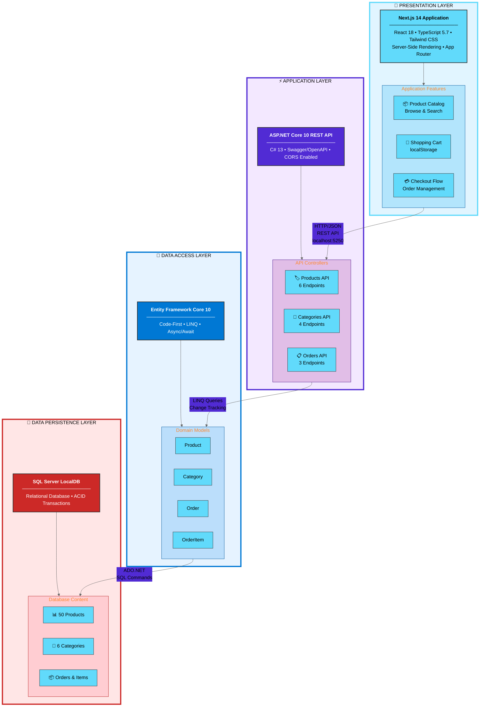

## Simplified Architecture (Presentation View)

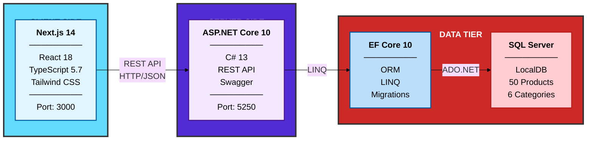

## Technology Stack at a Glance

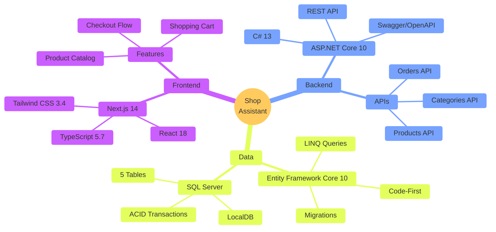

## Component Communication Flow

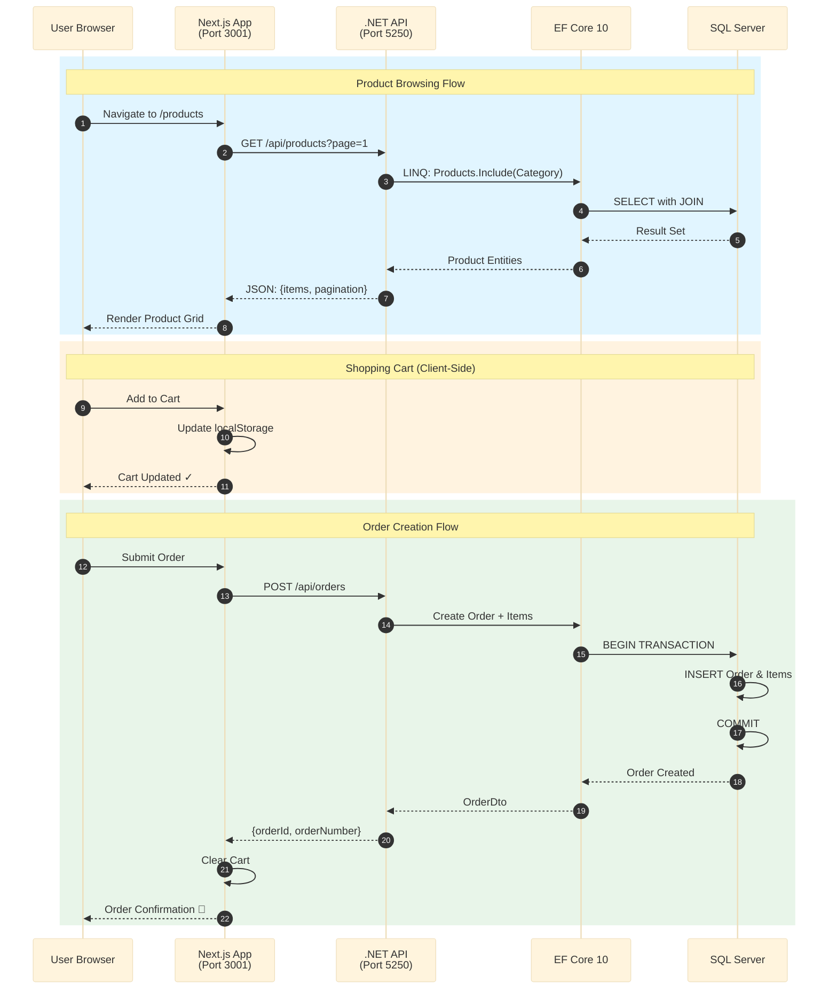

## Macro Architecture

```mermaid
graph TB
    subgraph "Frontend Layer"
        FE_Tech["<b>Next.js 14 / React 18</b><br/>─────────────────<br/>• TypeScript 5.7<br/>• Tailwind CSS 3.4<br/>• Framer Motion<br/>• Server-Side Rendering<br/>• App Router"]
        FE_Components["<b>Components</b><br/>─────────────────<br/>• Product Catalog<br/>• Shopping Cart<br/>• Checkout Flow<br/>• Order Tracking"]
        FE_State["<b>State Management</b><br/>─────────────────<br/>• localStorage (Cart)<br/>• React State<br/>• Server Components"]
    end
    
    subgraph "API Layer"
        API_Tech["<b>ASP.NET Core 10</b><br/>─────────────────<br/>• C# 13<br/>• REST API<br/>• Swagger/OpenAPI<br/>• CORS Enabled<br/>• JSON Serialization"]
        API_Endpoints["<b>API Endpoints</b><br/>─────────────────<br/>• Products (6)<br/>• Categories (4)<br/>• Orders (3)"]
        API_Features["<b>Features</b><br/>─────────────────<br/>• Filtering & Sorting<br/>• Pagination<br/>• Search<br/>• Validation"]
    end
    
    subgraph "Data Access Layer"
        ORM["<b>Entity Framework Core 10</b><br/>─────────────────<br/>• Code-First Approach<br/>• Migrations<br/>• LINQ Queries<br/>• Change Tracking<br/>• Async Operations"]
        Models["<b>Domain Models</b><br/>─────────────────<br/>• Product<br/>• Category<br/>• Order<br/>• OrderItem<br/>• Address"]
    end
    
    subgraph "Data Layer"
        DB_Tech["<b>SQL Server LocalDB</b><br/>─────────────────<br/>• Relational Database<br/>• Transactions<br/>• Foreign Keys<br/>• Indexes"]
        DB_Schema["<b>Schema</b><br/>─────────────────<br/>• 5 Tables<br/>• 50 Products<br/>• 6 Categories<br/>• Normalized Design"]
    end
    
    FE_Tech --> FE_Components
    FE_Components --> FE_State
    
    FE_State -->|"HTTP/JSON<br/>Port 5250"| API_Tech
    
    API_Tech --> API_Endpoints
    API_Endpoints --> API_Features
    
    API_Features --> ORM
    ORM --> Models
    
    Models --> DB_Tech
    DB_Tech --> DB_Schema
    
    style FE_Tech fill:#61dafb,stroke:#333,stroke-width:2px,color:#000
    style API_Tech fill:#512bd4,stroke:#333,stroke-width:2px,color:#fff
    style ORM fill:#0078d4,stroke:#333,stroke-width:2px,color:#fff
    style DB_Tech fill:#cc2927,stroke:#333,stroke-width:2px,color:#fff
```

## Technology Stack Summary

### Frontend Layer (Client-Side)
| Component | Technology | Purpose |
|-----------|-----------|---------|
| **Framework** | Next.js 14 | React framework with SSR, App Router |
| **UI Library** | React 18 | Component-based UI |
| **Language** | TypeScript 5.7 | Type safety & IDE support |
| **Styling** | Tailwind CSS 3.4 | Utility-first CSS framework |
| **Animation** | Framer Motion | Smooth transitions & effects |
| **Icons** | Lucide React | Icon components |
| **Build Tool** | Turbopack | Fast bundler (dev mode) |
| **Package Manager** | pnpm 10.20 | Efficient dependency management |
| **Deployment** | Vercel (ready) | Serverless hosting platform |

### Backend Layer (Server-Side)
| Component | Technology | Purpose |
|-----------|-----------|---------|
| **Framework** | ASP.NET Core 10 | High-performance web framework |
| **Language** | C# 13 | Modern, type-safe language |
| **API Style** | REST | HTTP-based CRUD operations |
| **Documentation** | Swagger/OpenAPI | Interactive API docs |
| **Middleware** | CORS, Logging | Cross-origin, diagnostics |
| **Validation** | Data Annotations | Input validation |
| **Serialization** | System.Text.Json | JSON serialization |
| **Hosting** | Kestrel | Cross-platform web server |
| **Deployment** | Azure App Service (ready) | Cloud hosting platform |

### Data Access Layer
| Component | Technology | Purpose |
|-----------|-----------|---------|
| **ORM** | Entity Framework Core 10 | Object-relational mapping |
| **Approach** | Code-First | Models define schema |
| **Migrations** | EF Core Migrations | Version control for schema |
| **Query Language** | LINQ | Type-safe queries in C# |
| **Change Tracking** | EF Core | Automatic change detection |
| **Connection Pooling** | Built-in | Efficient connection reuse |
| **Async/Await** | Full Support | Non-blocking I/O operations |

### Data Layer (Persistence)
| Component | Technology | Purpose |
|-----------|-----------|---------|
| **Database** | SQL Server LocalDB | Development database |
| **Production DB** | Azure SQL (ready) | Cloud relational database |
| **Version** | SQL Server 2022 | Latest features & performance |
| **Data Seeding** | Custom Seeder | Initialize with demo data |
| **Backup** | .mdf/.ldf files | Database files |

## Three-Tier Architecture

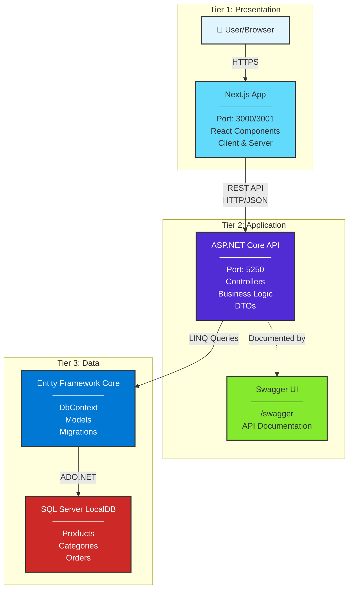

## Communication Flow

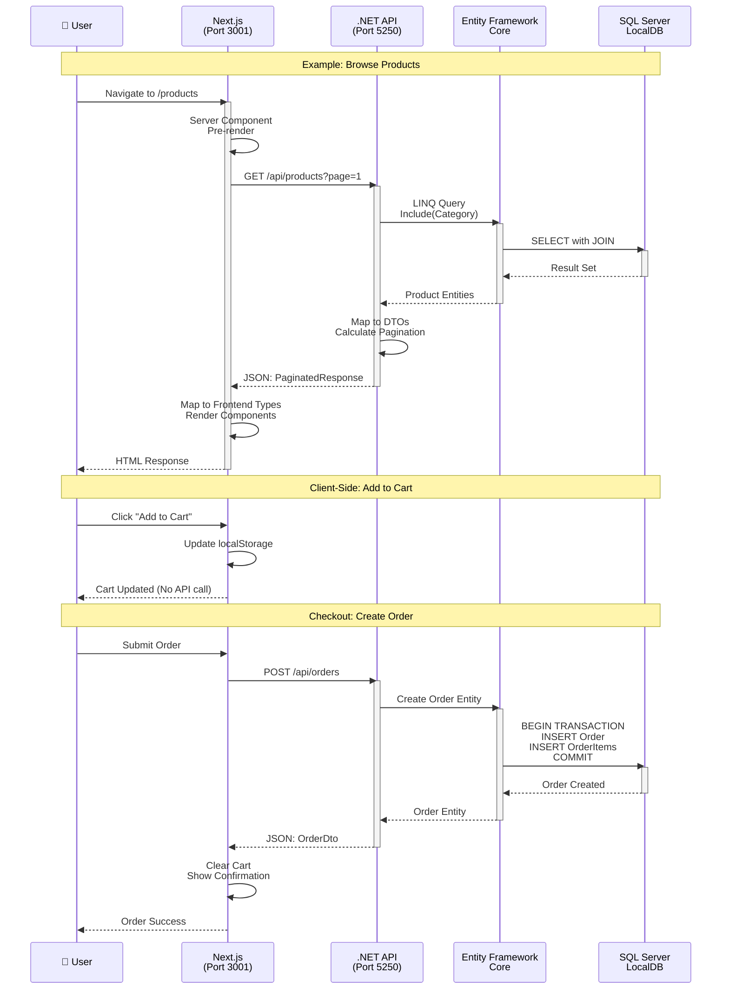

## High-Level Architecture

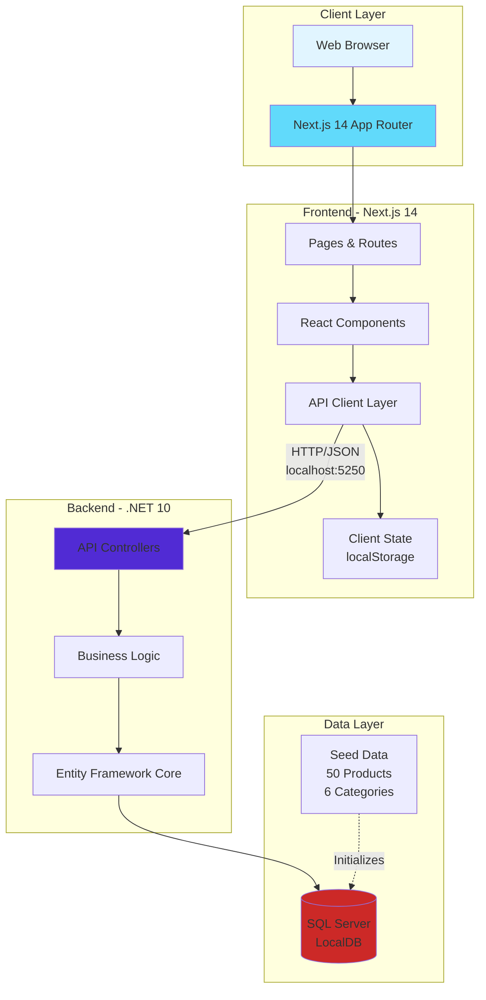

## Component Architecture

### Frontend Architecture (Next.js 14)

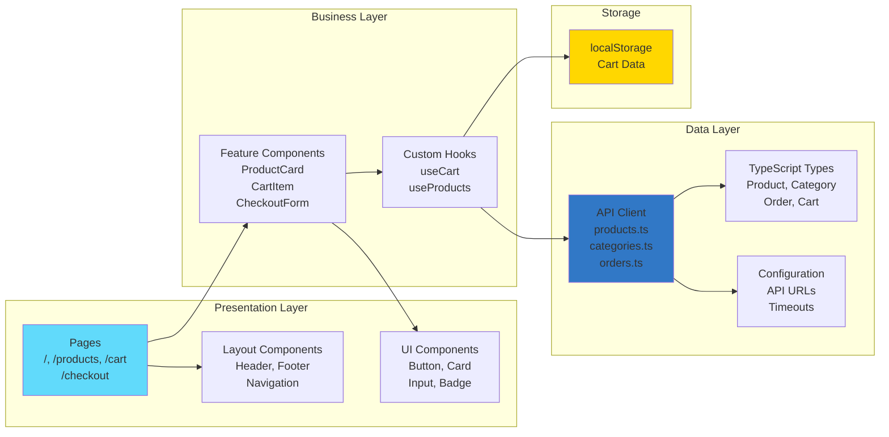

### Backend Architecture (.NET 10)

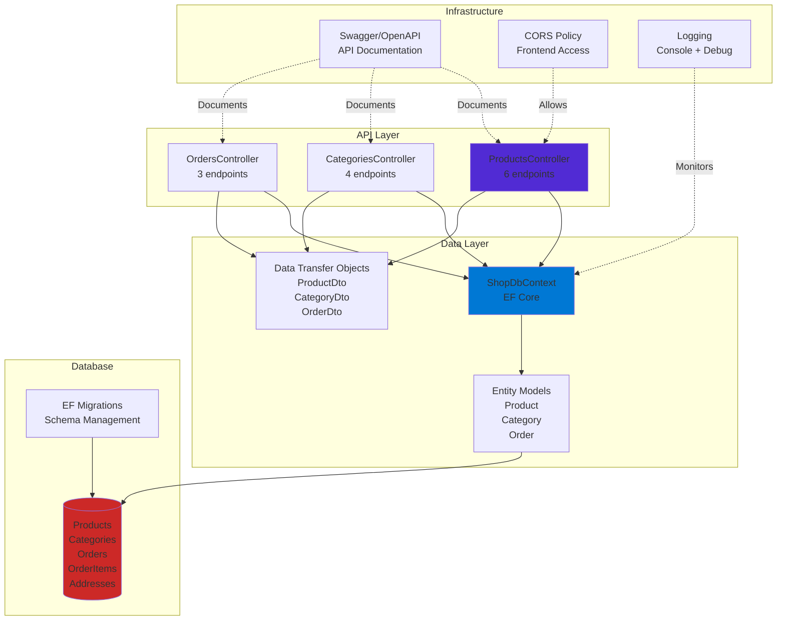

## Data Flow

### Product Listing Flow

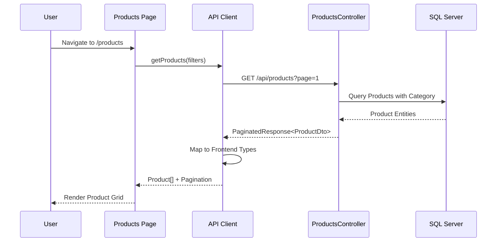

### Checkout Flow

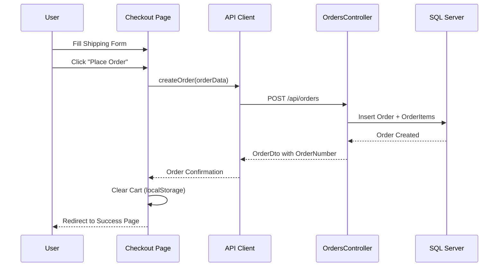

## Technology Stack

### Frontend Stack

| Layer | Technology | Version |
|-------|-----------|---------|
| Framework | Next.js | 14.2.35 |
| UI Library | React | 18.3.1 |
| Language | TypeScript | 5.7.3 |
| Styling | Tailwind CSS | 3.4.1 |
| Animation | Framer Motion | 11.15.0 |
| Icons | Lucide React | Latest |
| Package Manager | pnpm | 10.20.0 |

### Backend Stack

| Layer | Technology | Version |
|-------|-----------|---------|
| Framework | ASP.NET Core | .NET 10 |
| ORM | Entity Framework Core | 10.0.2 |
| Database | SQL Server | LocalDB |
| API Documentation | Swashbuckle (Swagger) | 7.2.0 |
| Language | C# | 13.0 |

## API Endpoints

### Products API
- `GET /api/products` - List products with filtering, sorting, pagination
- `GET /api/products/{id}` - Get product by ID (detailed)
- `GET /api/products/slug/{slug}` - Get product by slug
- `GET /api/products/search?searchQuery={q}` - Search products
- `GET /api/products/featured` - Get featured products
- `GET /api/products/new-arrivals` - Get new arrival products

### Categories API
- `GET /api/categories` - List all categories with product counts
- `GET /api/categories/{id}` - Get category by ID
- `GET /api/categories/slug/{slug}` - Get category by slug
- `GET /api/categories/{id}/products` - Get products in category

### Orders API
- `POST /api/orders` - Create new order
- `GET /api/orders/{id}` - Get order by ID
- `GET /api/orders/number/{orderNumber}` - Get order by order number

## Database Schema

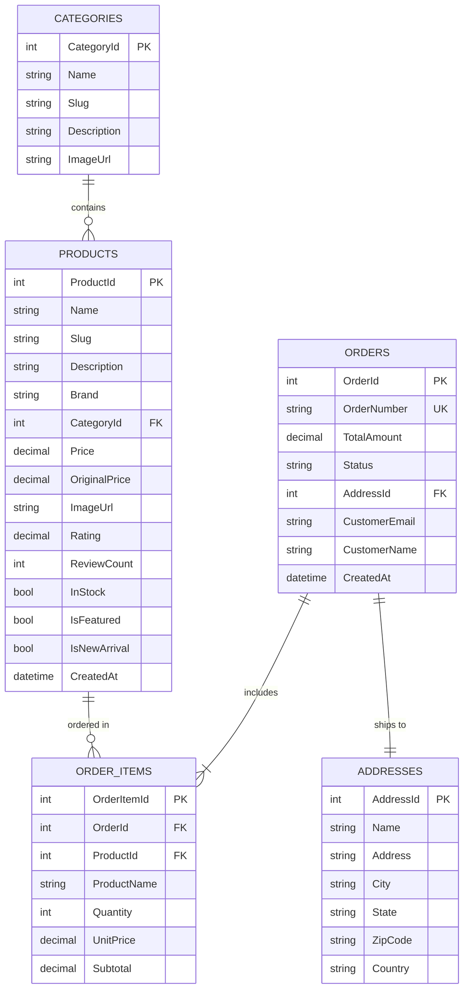

## Error Handling Strategy

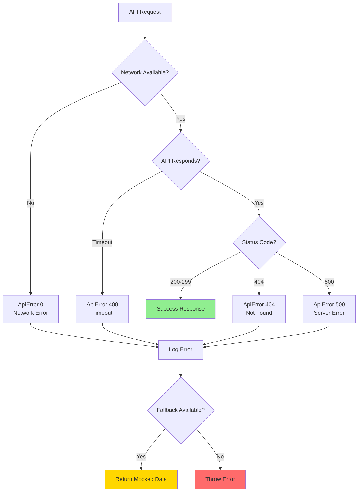

## Deployment Architecture

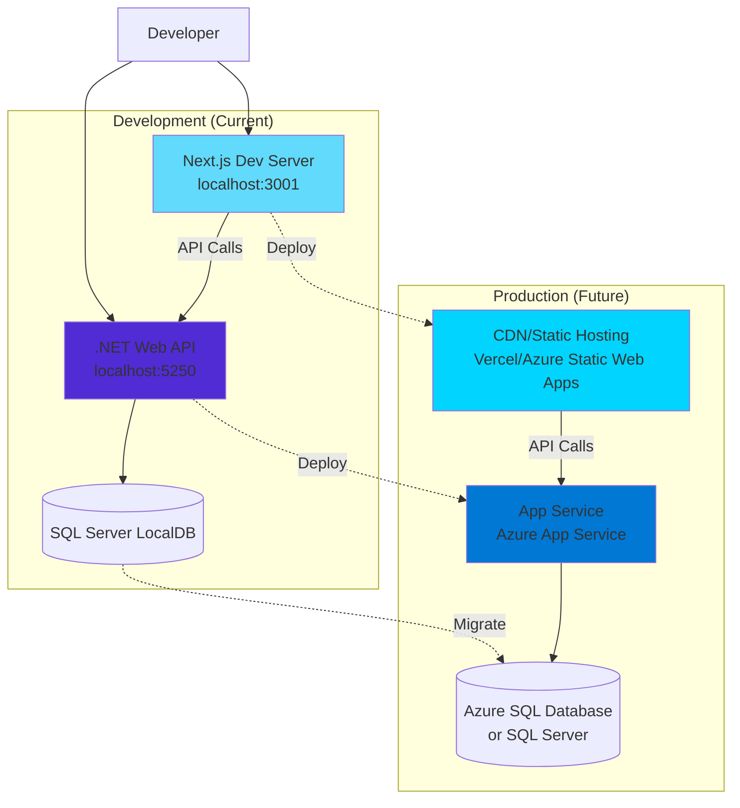

## Security Considerations

### Current Implementation
- CORS policy configured for frontend origin
- SQL parameterized queries via Entity Framework (SQL injection protection)
- Input validation via Data Annotations
- HTTPS redirection middleware (production)
- Sensitive data logging disabled in production

### Future Enhancements
- Authentication & Authorization (JWT/OAuth)
- API rate limiting
- Request/Response encryption
- CSRF protection
- Security headers (HSTS, CSP, X-Frame-Options)
- API key management for external services

## Performance Optimizations

### Frontend
- Static site generation for product pages (ISR)
- Image optimization with Next.js Image component
- Code splitting and lazy loading
- Client-side caching (SWR/React Query - future)
- localStorage for cart persistence

### Backend
- Database query optimization with `.AsNoTracking()`
- Pagination to limit result sets
- Indexed columns (CategoryId, Slug, ProductId)
- Response caching (future enhancement)
- Connection pooling (EF Core default)

## Scalability Path

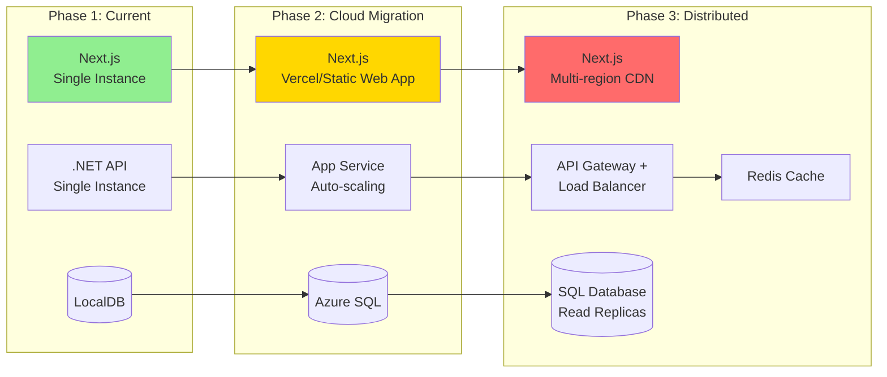

## Development Workflow

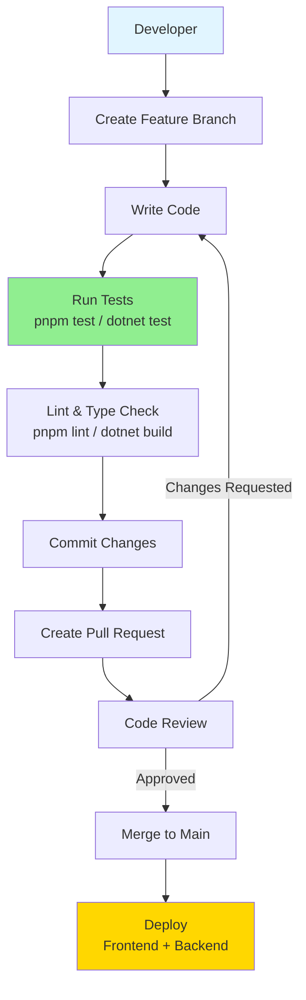

## Key Features Implemented

### ✅ Backend (TASK-001 to TASK-007)
- [x] .NET 10 Web API project structure
- [x] Entity Framework Core with SQL Server
- [x] Database migrations and seeding (50 products, 6 categories)
- [x] Products API (6 endpoints with filtering, sorting, pagination)
- [x] Categories API (4 endpoints)
- [x] Orders API (3 endpoints)
- [x] Swagger/OpenAPI documentation

### ✅ Frontend (TASK-008)
- [x] Next.js 14 with App Router
- [x] Type-safe API client with error handling
- [x] Product listing with filters and sorting
- [x] Product detail pages
- [x] Shopping cart (localStorage)
- [x] Checkout flow
- [x] Order confirmation
- [x] Graceful fallback to mocked data

### 🔄 Integration (TASK-008 Completed)
- [x] API client infrastructure
- [x] Type-safe DTOs matching backend
- [x] Error boundary component
- [x] Environment configuration
- [x] Full-stack data flow verification

## Documentation

- **API Docs**: [http://localhost:5250/swagger](http://localhost:5250/swagger)
- **Frontend README**: [frontend/README.md](../frontend/README.md)
- **Backend README**: [backend/README.md](../backend/README.md)
- **ADR 009**: [Frontend-Backend Integration](../specs/adr/009-frontend-backend-integration.md)

## Running the Application

### Prerequisites
- .NET 10 SDK
- Node.js 18+ and pnpm
- SQL Server LocalDB

### Start Backend
```bash
cd backend
dotnet run
# API available at http://localhost:5250
# Swagger UI at http://localhost:5250/swagger
```

### Start Frontend
```bash
cd frontend
pnpm install
pnpm dev
# App available at http://localhost:3000
```

## Repository Structure

```
shop-assistant/
├── backend/                 # .NET 10 Web API
│   ├── Controllers/        # API endpoints
│   ├── Models/            # Entity models
│   ├── DTOs/              # Data transfer objects
│   ├── Data/              # DbContext & seed data
│   └── Migrations/        # EF Core migrations
├── frontend/               # Next.js 14 App
│   ├── app/               # Pages (App Router)
│   ├── components/        # React components
│   ├── lib/               # Utilities & API client
│   ├── data/              # Mocked data (fallback)
│   └── public/            # Static assets
├── docs/                   # Documentation
├── specs/                  # Specifications & ADRs
└── .gitignore             # Version control exclusions
```
