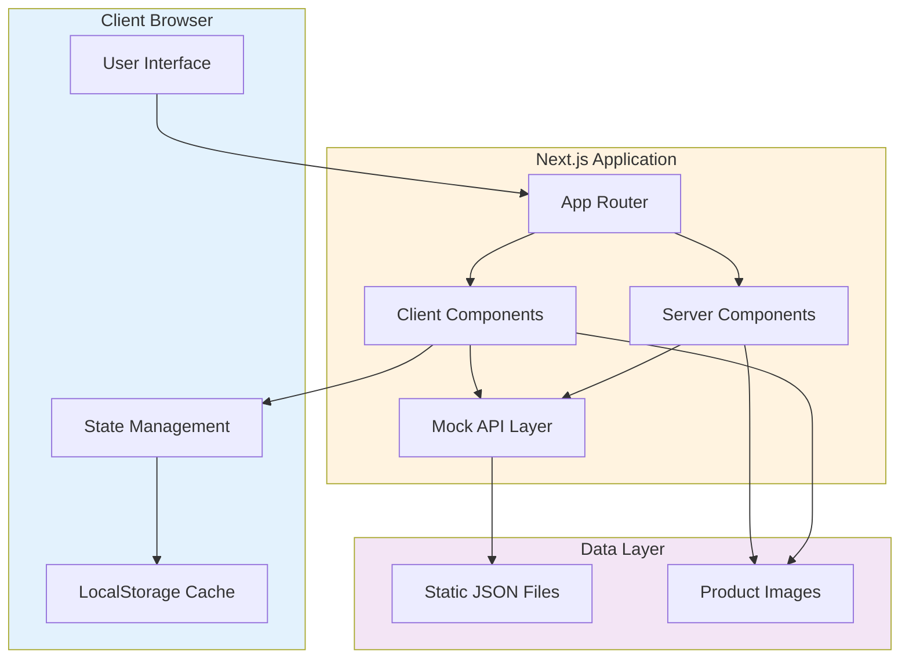
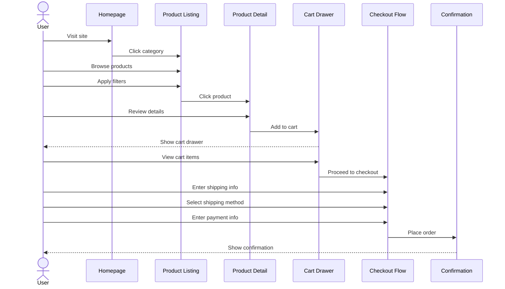
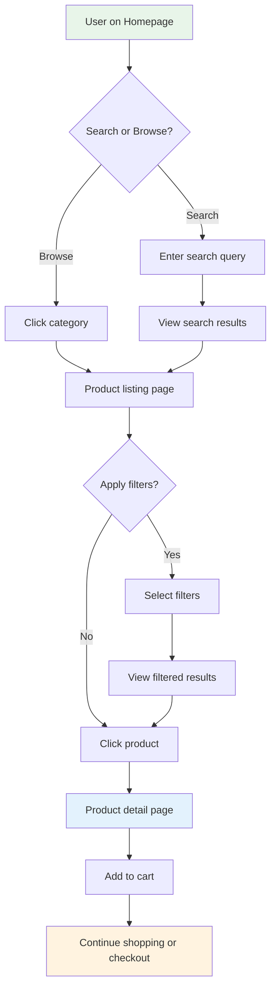
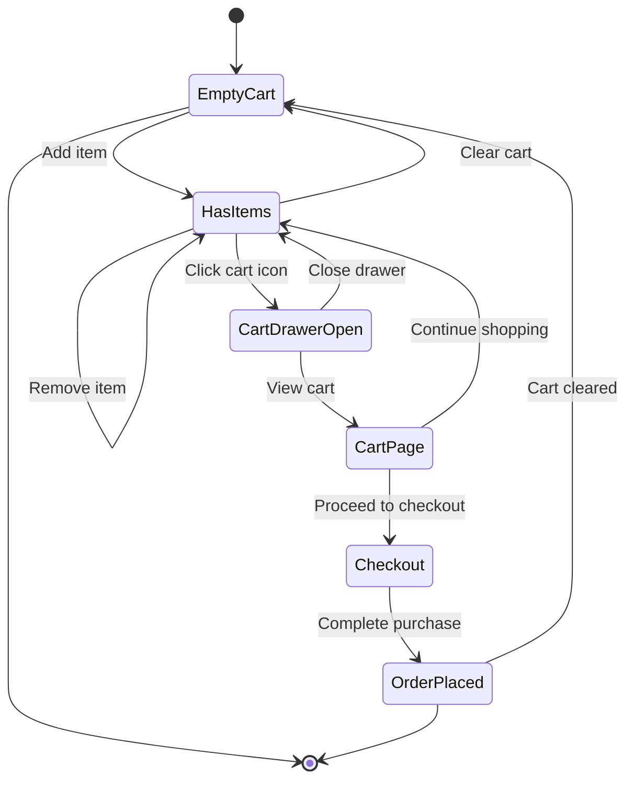
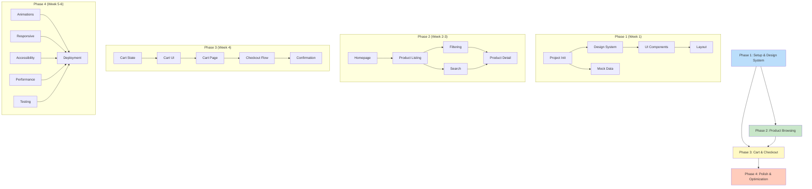

# Shop Assistant Implementation Plan

**Project**: Shop Assistant E-Commerce Demo  
**Version**: 1.0  
**Created**: January 9, 2026  
**Timeline**: 5-6 weeks

---

## Table of Contents

- [Architecture Overview](#architecture-overview)
  - [L0: System Overview](#l0-system-overview)
  - [L1: Major Components](#l1-major-components)
  - [L2: Detailed Component Structure](#l2-detailed-component-structure)
  - [L3: User Flows](#l3-user-flows)
- [Implementation Phases](#implementation-phases)
  - [Phase 1: Setup & Design System](#phase-1-setup--design-system-week-1)
  - [Phase 2: Product Browsing Features](#phase-2-product-browsing-features-week-2-3)
  - [Phase 3: Cart & Checkout](#phase-3-cart--checkout-week-4)
  - [Phase 4: Polish & Optimization](#phase-4-polish--optimization-week-5-6)
- [Dependencies & Critical Path](#dependencies--critical-path)
- [Risk Mitigation](#risk-mitigation)

---

## Architecture Overview

### L0: System Overview



**Key Characteristics**:
- **Zero Backend**: All data served from static JSON files
- **Hybrid Rendering**: Server Components for initial render, Client Components for interactivity
- **Persistent State**: Cart and user data stored in localStorage
- **Offline-Ready**: No external API dependencies

---

### L1: Major Components

```mermaid
graph LR
    subgraph Layout["Layout System"]
        Header[Header/Navigation]
        Footer[Footer]
        MobileMenu[Mobile Menu]
    end
    
    subgraph Products["Product Module"]
        Listing[Product Listing]
        Detail[Product Detail]
        Filters[Filter Panel]
        Search[Search System]
    end
    
    subgraph Cart["Cart Module"]
        CartDrawer[Cart Drawer]
        CartPage[Cart Page]
        CartState[Cart State]
    end
    
    subgraph Checkout["Checkout Module"]
        Steps[Checkout Steps]
        Shipping[Shipping Form]
        Payment[Payment Form]
        Confirmation[Order Confirmation]
    end
    
    Layout --> Products
    Layout --> Cart
    Layout --> Checkout
    Products --> Cart
    Cart --> Checkout
    
    style Layout fill:#bbdefb
    style Products fill:#c8e6c9
    style Cart fill:#fff9c4
    style Checkout fill:#ffccbc
```



**Module Responsibilities**:
- **Layout**: Navigation, branding, global UI elements
- **Products**: Catalog browsing, search, filtering, detail views
- **Cart**: Shopping cart management, item operations
- **Checkout**: Multi-step purchase flow, form validation

---

### L2: Detailed Component Structure

```mermaid
graph TB
    subgraph UI["UI Primitives"]
        Button[Button]
        Input[Input]
        Modal[Modal]
        Badge[Badge]
        Card[Card]
        Skeleton[Skeleton]
    end
    
    subgraph ProductComps["Product Components"]
        ProductCard[ProductCard]
        ProductGrid[ProductGrid]
        ProductGallery[ProductGallery]
        ProductFilters[ProductFilters]
        FilterPanel[FilterPanel]
        SortDropdown[SortDropdown]
    end
    
    subgraph CartComps["Cart Components"]
        CartIcon[CartIcon + Badge]
        CartDrawerComp[CartDrawer]
        CartItem[CartItem]
        CartSummary[CartSummary]
        QuantitySelector[QuantitySelector]
    end
    
    subgraph CheckoutComps["Checkout Components"]
        ProgressSteps[ProgressSteps]
        ShippingForm[ShippingForm]
        PaymentForm[PaymentForm]
        AddressForm[AddressForm]
        OrderSummary[OrderSummary]
    end
    
    subgraph Context["State Context"]
        CartContext[CartContext]
        UserContext[UserContext]
    end
    
    subgraph Hooks["Custom Hooks"]
        useCart[useCart]
        useCartActions[useCartActions]
        useLocalStorage[useLocalStorage]
        useMediaQuery[useMediaQuery]
    end
    
    ProductCard --> Card
    ProductCard --> Badge
    ProductCard --> Button
    
    CartDrawerComp --> Modal
    CartItem --> QuantitySelector
    CartItem --> Button
    
    ShippingForm --> Input
    PaymentForm --> Input
    
    ProductComps --> useCart
    CartComps --> useCart
    CheckoutComps --> useCart
    
    useCart --> CartContext
    CartContext --> useLocalStorage
    
    style UI fill:#e1f5fe
    style ProductComps fill:#c8e6c9
    style CartComps fill:#fff9c4
    style CheckoutComps fill:#ffccbc
    style Context fill:#f3e5f5
    style Hooks fill:#ffe0b2
```



**Component Hierarchy**:
- **UI Primitives**: Reusable, unstyled components (Headless UI)
- **Feature Components**: Domain-specific components built on primitives
- **Context Providers**: Global state management
- **Custom Hooks**: Business logic extraction

---

### L3: Key User Flows

#### Flow 1: Browse to Purchase



#### Flow 2: Search and Filter



#### Flow 3: Cart Management



---

## Implementation Phases

### Phase 1: Setup & Design System (Week 1)

**Objective**: Establish project foundation, design tokens, and reusable UI components

#### Tasks

1. **Project Initialization**
   - [ ] Initialize Next.js 14 with TypeScript and Tailwind CSS
   - [ ] Configure pnpm workspace
   - [ ] Set up ESLint, Prettier, TypeScript strict mode
   - [ ] Configure Git repository and commit conventions
   - **Estimated**: 0.5 days

2. **Design System Implementation**
   - [ ] Define design tokens in `tailwind.config.js` (colors, spacing, typography)
   - [ ] Create utility function `cn()` for class merging
   - [ ] Document color palette and usage guidelines
   - **Estimated**: 1 day

3. **UI Primitive Components**
   - [ ] Button (variants: primary, secondary, ghost)
   - [ ] Input (text, email, number with validation states)
   - [ ] Card (product card base structure)
   - [ ] Badge (cart count, sale badges)
   - [ ] Modal/Drawer (base component with animations)
   - [ ] Skeleton (loading states)
   - **Estimated**: 2 days

4. **Layout Components**
   - [ ] Header with navigation (sticky, shrink on scroll)
   - [ ] Footer (sitemap, social links)
   - [ ] Mobile hamburger menu with slide-in animation
   - [ ] Responsive breakpoint implementation
   - **Estimated**: 1.5 days

5. **Mock Data Structure**
   - [ ] Create TypeScript interfaces (`Product`, `Category`, `Review`, etc.)
   - [ ] Write data generation script with Faker.js
   - [ ] Generate 80-100 products across 6 categories
   - [ ] Curate product images (download from Unsplash, organize by category)
   - [ ] Create mock API layer (`getProducts`, `getProductById`, `searchProducts`)
   - **Estimated**: 1 day

**Deliverables**:
- Fully configured Next.js project with design system
- 10-15 reusable UI components with variants
- Complete mock data (products, categories, brands)
- Project documentation (README, component usage)

**Dependencies**: None

---

### Phase 2: Product Browsing Features (Week 2-3)

**Objective**: Implement product catalog, filtering, search, and detail views

#### Tasks

1. **Homepage**
   - [ ] Hero banner with promotional image
   - [ ] Featured categories grid (6 categories)
   - [ ] "Best Sellers" carousel with navigation arrows
   - [ ] "New Arrivals" section
   - [ ] Responsive layout (mobile, tablet, desktop)
   - **Estimated**: 1.5 days

2. **Product Listing Page**
   - [ ] Product grid with responsive columns (4→3→2→1)
   - [ ] ProductCard component with image, name, price, rating
   - [ ] Hover states and animations (elevation, quick add button)
   - [ ] Skeleton loading states
   - [ ] Pagination or infinite scroll
   - **Estimated**: 2 days

3. **Filtering System**
   - [ ] Filter panel sidebar (desktop) / drawer (mobile)
   - [ ] Price range slider
   - [ ] Category selection
   - [ ] Brand multi-select checkboxes
   - [ ] Rating filter (4+ stars, 3+ stars, etc.)
   - [ ] Active filter badges with dismiss action
   - [ ] Filter state management (URL params or local state)
   - **Estimated**: 2 days

4. **Sorting & Search**
   - [ ] Sort dropdown (Featured, Price, Rating, Newest)
   - [ ] Search bar in header
   - [ ] Real-time search suggestions (debounced)
   - [ ] Search results page with highlighting
   - [ ] "No results" state with suggestions
   - **Estimated**: 1.5 days

5. **Product Detail Page**
   - [ ] Large image gallery with thumbnail navigation
   - [ ] Zoom on hover/click functionality
   - [ ] Product info panel (title, brand, price, rating)
   - [ ] Variant selection (color, size with visual swatches)
   - [ ] Quantity selector with +/- buttons
   - [ ] "Add to Cart" button with loading state
   - [ ] Product description tabs (Overview, Specs, Reviews, Shipping)
   - [ ] Related products carousel
   - [ ] Breadcrumb navigation
   - **Estimated**: 3 days

**Deliverables**:
- Fully functional product browsing experience
- Filtering and sorting with URL persistence
- Search functionality with suggestions
- Detailed product pages with image galleries
- Responsive across all breakpoints

**Dependencies**: 
- Phase 1 (UI components, mock data)

---

### Phase 3: Cart & Checkout (Week 4)

**Objective**: Implement shopping cart and complete checkout flow

#### Tasks

1. **Cart State Management**
   - [ ] Create CartContext with useReducer
   - [ ] Implement cart actions (add, remove, update quantity, clear)
   - [ ] localStorage persistence (save/load on mount)
   - [ ] Create `useCart` and `useCartActions` hooks
   - [ ] Cart selectors (total items, subtotal, etc.)
   - **Estimated**: 1 day

2. **Cart UI Components**
   - [ ] Cart icon with animated badge (item count)
   - [ ] Cart drawer (slide from right with Framer Motion)
   - [ ] CartItem component (thumbnail, name, quantity, price, remove button)
   - [ ] Quantity controls with debounced updates
   - [ ] Cart summary (subtotal, actions)
   - [ ] Empty cart state with CTA
   - [ ] Toast notifications ("Added to cart!")
   - **Estimated**: 2 days

3. **Cart Page**
   - [ ] Full-page cart view with editable quantities
   - [ ] "Save for Later" option (optional)
   - [ ] Promotional code input field (mock validation)
   - [ ] Order summary sidebar (subtotal, shipping estimate, tax, total)
   - [ ] "Continue Shopping" and "Proceed to Checkout" buttons
   - **Estimated**: 1 day

4. **Checkout Flow**
   - [ ] Multi-step progress indicator (4 steps)
   - [ ] Step 1: Shipping information form (address validation)
   - [ ] Step 2: Shipping method selection (radio buttons, delivery estimates)
   - [ ] Step 3: Payment form (card number, expiration, CVV - mock only)
   - [ ] Step 4: Review & place order (summary with edit links)
   - [ ] Form validation with inline error messages
   - [ ] Loading states during "submission"
   - **Estimated**: 2.5 days

5. **Order Confirmation**
   - [ ] Success page with checkmark animation
   - [ ] Order number generation
   - [ ] Order summary display
   - [ ] Estimated delivery date
   - [ ] "Continue Shopping" CTA
   - [ ] Clear cart state on order completion
   - **Estimated**: 0.5 days

**Deliverables**:
- Fully functional shopping cart with persistence
- Multi-step checkout flow with validation
- Order confirmation page
- Cart state synchronized across all pages

**Dependencies**:
- Phase 1 (UI components, state management patterns)
- Phase 2 (Product pages to add items from)

---

### Phase 4: Polish & Optimization (Week 5-6)

**Objective**: Animations, responsive refinement, performance optimization, and final testing

#### Tasks

1. **Animation Implementation**
   - [ ] Page transition animations (fade-in on route change)
   - [ ] Modal/drawer slide-in/out with AnimatePresence
   - [ ] Cart count badge bounce animation on add
   - [ ] Product card entrance animations (stagger)
   - [ ] Success checkmark animation (order confirmation)
   - [ ] Smooth scroll to top on navigation
   - [ ] Respect `prefers-reduced-motion`
   - **Estimated**: 2 days

2. **Responsive Design Refinement**
   - [ ] Mobile navigation testing and fixes
   - [ ] Tablet layout adjustments
   - [ ] Touch-friendly targets (44x44px minimum)
   - [ ] Swipeable product galleries on mobile
   - [ ] Sticky header behavior on mobile scroll
   - [ ] Test on real devices (iOS, Android)
   - **Estimated**: 1.5 days

3. **Accessibility Improvements**
   - [ ] Keyboard navigation (Tab, Enter, Esc)
   - [ ] Focus indicators on all interactive elements
   - [ ] ARIA labels and roles
   - [ ] Screen reader testing (NVDA/VoiceOver)
   - [ ] Color contrast validation (WCAG AA)
   - [ ] Alt text for all images
   - [ ] Skip to content link
   - **Estimated**: 1.5 days

4. **Performance Optimization**
   - [ ] Lazy load images below fold
   - [ ] Code splitting for routes (dynamic imports)
   - [ ] Optimize image formats (WebP with JPEG fallback)
   - [ ] Memoize expensive calculations (useMemo)
   - [ ] Reduce re-renders (React.memo, useCallback)
   - [ ] Bundle analysis and tree-shaking verification
   - [ ] Run Lighthouse audits (target >90 all metrics)
   - **Estimated**: 1.5 days

5. **Testing & Bug Fixes**
   - [ ] Cross-browser testing (Chrome, Firefox, Safari, Edge)
   - [ ] E2E tests for critical paths (Playwright)
   - [ ] Manual testing checklist completion
   - [ ] Fix identified bugs and edge cases
   - [ ] Console error cleanup
   - [ ] Empty states and error handling verification
   - **Estimated**: 1.5 days

6. **Documentation & Demo Preparation**
   - [ ] Update README with setup instructions
   - [ ] Create demo script for presentations
   - [ ] Populate demo cart with sample products
   - [ ] Create bookmark links for key demo pages
   - [ ] Record demo walkthrough video (optional)
   - **Estimated**: 1 day

7. **Deployment**
   - [ ] Configure Vercel deployment
   - [ ] Set up environment variables
   - [ ] Configure custom domain (optional)
   - [ ] Verify production build
   - [ ] Performance testing in production
   - [ ] Smoke testing deployed application
   - **Estimated**: 0.5 days

**Deliverables**:
- Smooth animations throughout application
- Fully responsive and accessible
- Lighthouse score >90 (Performance, A11y, Best Practices, SEO)
- Deployed to production with custom domain
- Complete documentation and demo script

**Dependencies**:
- All previous phases completed

---

## Dependencies & Critical Path

### Dependency Graph



### Critical Path Items (Cannot Slip)

1. **Design System & UI Components** (Week 1)
   - All subsequent development depends on base components
   - Must include Button, Input, Card, Modal, Skeleton

2. **Mock Data Structure** (Week 1)
   - Product browsing and cart require defined data schemas
   - TypeScript interfaces must be complete

3. **Product Listing** (Week 2)
   - Foundation for filtering, search, and detail pages
   - ProductCard component reused throughout app

4. **Cart State Management** (Week 4)
   - All cart/checkout features depend on state architecture
   - Must implement persistence early

5. **Responsive Design Testing** (Week 5)
   - Mobile issues can cascade into multiple fixes
   - Test early and continuously

### Parallel Work Opportunities

**Week 2-3**:
- Product listing can be developed in parallel with search/filtering
- Homepage can be built while product detail page is in progress

**Week 5-6**:
- Animations can be added in parallel with accessibility improvements
- Performance optimization can happen while testing is ongoing

---

## Risk Mitigation

### High-Priority Risks

1. **Risk**: Design system incomplete by end of Week 1
   - **Impact**: Delays all UI development
   - **Mitigation**: Focus on core primitives first (Button, Input, Card), defer nice-to-haves
   - **Owner**: Frontend Lead

2. **Risk**: Safari/iOS compatibility issues discovered late
   - **Impact**: Extensive rework in final week
   - **Mitigation**: Test on Safari/iOS starting Week 2, allocate buffer in Week 5
   - **Owner**: QA/Developer

3. **Risk**: Animation performance issues on mid-range devices
   - **Impact**: Janky demo experience
   - **Mitigation**: Use CSS transforms only, test on real devices early, implement performance mode toggle
   - **Owner**: Frontend Developer

4. **Risk**: Scope creep with "just one more feature"
   - **Impact**: Incomplete polish, missed deadline
   - **Mitigation**: Strict feature freeze after Phase 2, maintain "v2 backlog" separately
   - **Owner**: Product Owner

5. **Risk**: Cart state synchronization bugs
   - **Impact**: Items disappear, quantities incorrect
   - **Mitigation**: Implement cart state early (Week 4 Day 1), thorough testing of all cart operations
   - **Owner**: State Management Lead

### Quality Gates

**End of Week 1**:
- [ ] All UI primitives complete and documented
- [ ] Design tokens configured in Tailwind
- [ ] Mock data generated (100 products)
- [ ] Basic layout (header, footer) functional

**End of Week 3**:
- [ ] Product listing with filtering works
- [ ] Search functional
- [ ] Product detail page complete
- [ ] Responsive on mobile, tablet, desktop

**End of Week 4**:
- [ ] Cart functionality complete
- [ ] Checkout flow end-to-end
- [ ] Order confirmation works
- [ ] Cart persists across sessions

**End of Week 6**:
- [ ] Lighthouse score >90 all metrics
- [ ] No console errors
- [ ] Tested on Chrome, Firefox, Safari
- [ ] Deployed to production
- [ ] Demo script ready

---

## Success Metrics

**Technical Metrics**:
- Lighthouse Performance: >90
- Lighthouse Accessibility: >90
- First Contentful Paint: <1.5s
- Largest Contentful Paint: <2.5s
- Bundle size (JS): <100KB (gzipped)

**Functional Metrics**:
- All critical user flows complete (browse → purchase)
- Cart persistence working 100%
- Zero console errors in production
- Responsive on all target devices

**Demo Quality**:
- "Wow factor" within 10 seconds of viewing
- Smooth animations at 60fps
- No visual glitches or jank
- Professional appearance comparable to production e-commerce sites

---

## Appendix

### Technology Stack Summary

- **Framework**: Next.js 14 (App Router)
- **Language**: TypeScript 5.x (Strict mode)
- **Styling**: Tailwind CSS 3.4.x
- **Animations**: Framer Motion
- **State**: React Context + useReducer
- **Storage**: localStorage
- **Deployment**: Vercel

### File Structure Reference

```
shop-assistant/
├── public/
│   └── images/products/...
├── src/
│   ├── app/
│   │   ├── (shop)/
│   │   │   ├── products/
│   │   │   ├── cart/
│   │   │   └── checkout/
│   │   └── layout.tsx
│   ├── components/
│   │   ├── ui/
│   │   ├── product/
│   │   ├── cart/
│   │   ├── checkout/
│   │   └── layout/
│   ├── context/
│   │   ├── cart-context.tsx
│   │   └── user-context.tsx
│   ├── lib/
│   │   ├── api/
│   │   ├── hooks/
│   │   ├── types/
│   │   └── utils/
│   └── data/
│       └── products.json
└── specs/
    ├── prd.md
    ├── adr/
    └── PLAN.md (this file)
```

### Key Resources

- [PRD](prd.md)
- [ADR-001: Framework Selection](adr/001-framework-selection.md)
- [ADR-002: Styling Approach](adr/002-styling-approach.md)
- [ADR-003: Animation Library](adr/003-animation-library.md)
- [ADR-004: State Management](adr/004-state-management.md)
- [ADR-005: Mock Data Strategy](adr/005-mock-data-strategy.md)
- [AGENTS.md](../AGENTS.md)

---

**Plan Status**: Ready for Implementation  
**Last Updated**: January 9, 2026  
**Next Review**: End of Week 1

For questions or updates to this plan, contact the Technical Lead.
